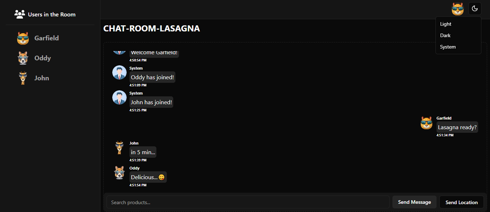

# Chat App
This is a chat app built using ReactJs, expressJs and Socket.io. User can Create/Join a chat room just using a username and ID of the chat room by selecting a icon.

**Several chat rooms can be created at the same time and a user can leave one chat room and join another chat room at the same time**

## Chat Room
Each chat room can have a user with a unique username that is not similar to another user's username.

When a new user joins and leaves the chat room, it indicates to the remaining users in the chat room.

Users can see who is in the chat room with the sidebar on the left and also **each user can share their location to others.**

## Theme
User can change to light or dark mode.

TECHNOLOGIES USED:

**Socket.io, ReactJs, JavaScript, ShadcnUi/MagicUi, ExpressJs**
