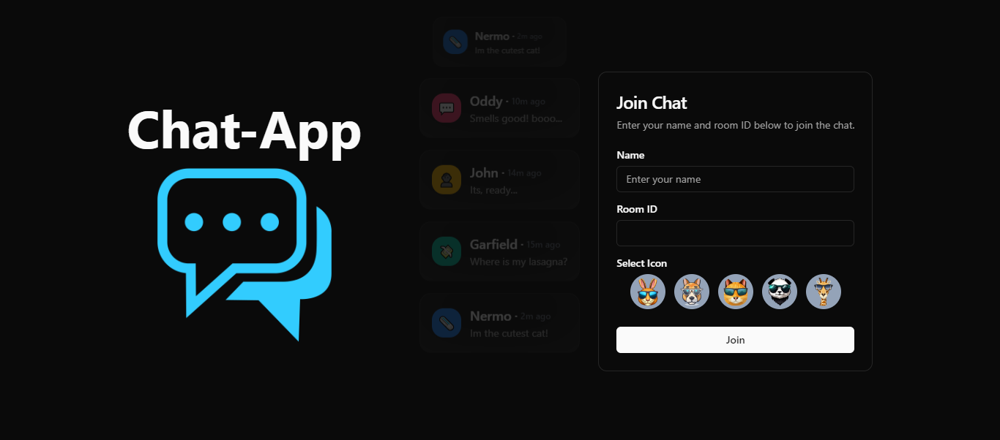
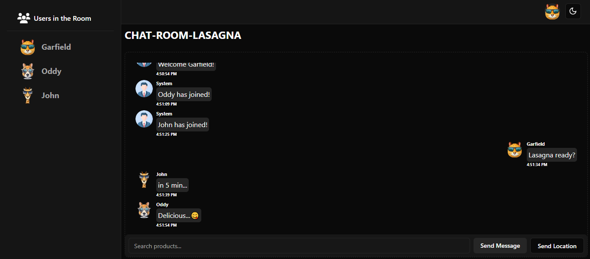
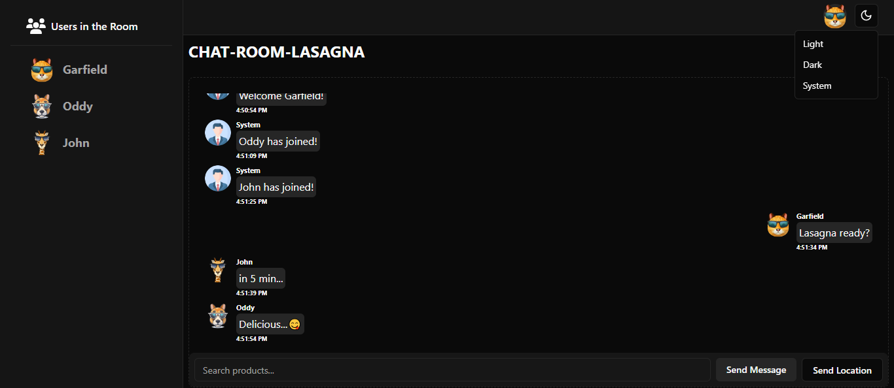

# 💬 Real-Time Chat App
A **real-time chat application** built to showcase my skills with Socket.io and React.js. This app demonstrates core real-time communication features, such as joining rooms, sending messages, and sharing location — all handled locally without a database.

# ✨ Technologies
- Socket.io
- React.js
- Express.js
- Typescript
- Shadcn UI / Magic UI

# 🚀 Features
## 🧑‍🤝‍🧑 Create & Join Chat Rooms
- Join or create chat rooms using a username and room ID
- Multiple chat rooms can exist simultaneously
- Users can switch between rooms at any time
- Real-time entry/exit notifications for all participants

## 💬 Real-Time Messaging
- Real-time communication powered by Socket.io
- Each user has a unique username within a chat room
- View current room members in a live sidebar
- Share your current location with others in the chat

## 🎨 Light & Dark Theme Toggle
- Switch between light mode and dark mode for a personalized experience

# 📌 Highlights
- Real-time location sharing
- Real-time user presence notifications
- Unique usernames per room enforced
- Clean and modern UI with Shadcn UI / Magic UI
- Fully responsive for different screen sizes

# 🎯 Final Note
This chat app is a lightweight but powerful example of real-time web communication using WebSockets. It's built to be fast, intuitive, and scalable, perfect for both personal use and as a foundational project to build more advanced messaging systems.

# 🛠️ How to Run Locally
1. Clone the Backend: **https://github.com/WebDevProCM/chat-app-backend**
2. Install dependencies: npm install
3. Start the server: node --env-file=.env index.js
4. Clone this repository and then do step 2
5. Start the development server: npm run dev
6. Visit HTTP://localhost:5173 in your browser

# 🍿 Video
https://github.com/user-attachments/assets/dfe6c3b3-fe8d-4eba-b79e-fa625c099432
